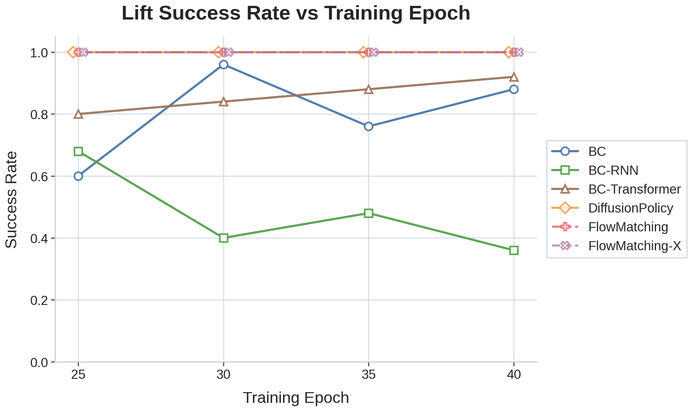
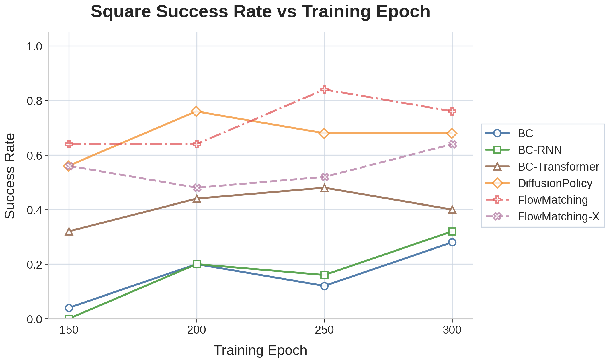

# Success Rate vs Training Epochs

## Figures

### Lift

### Square

## Summary

| Method | Task | Eval Epochs | Success Rates | Best | Final |
| --- | --- | --- | --- | --- | --- |
| BC | Lift | 25, 30, 35, 40 | 0.60, 0.96, 0.76, 0.88 | 0.96 | 0.88 |
| BC | Square | 150, 200, 250, 300 | 0.04, 0.20, 0.12, 0.28 | 0.28 | 0.28 |
| BC-RNN | Lift | 25, 30, 35, 40 | 0.68, 0.40, 0.48, 0.36 | 0.68 | 0.36 |
| BC-RNN | Square | 150, 200, 250, 300 | 0.00, 0.20, 0.16, 0.32 | 0.32 | 0.32 |
| BC-Transformer | Lift | 25, 30, 35, 40 | 0.80, 0.84, 0.88, 0.92 | 0.92 | 0.92 |
| BC-Transformer | Square | 150, 200, 250, 300 | 0.32, 0.44, 0.48, 0.40 | 0.48 | 0.40 |
| DiffusionPolicy | Lift | 25, 30, 35, 40 | 1.00, 1.00, 1.00, 1.00 | 1.00 | 1.00 |
| DiffusionPolicy | Square | 150, 200, 250, 300 | 0.56, 0.76, 0.68, 0.68 | 0.76 | 0.68 |
| FlowMatching | Lift | 25, 30, 35, 40 | 1.00, 1.00, 1.00, 1.00 | 1.00 | 1.00 |
| FlowMatching | Square | 150, 200, 250, 300 | 0.64, 0.64, 0.84, 0.76 | 0.84 | 0.76 |
| FlowMatching-X | Lift | 25, 30, 35, 40 | 1.00, 1.00, 1.00, 1.00 | 1.00 | 1.00 |
| FlowMatching-X | Square | 150, 200, 250, 300 | 0.56, 0.48, 0.52, 0.64 | 0.64 | 0.64 |

## Detailed Tables

### Lift

| Epoch | BC | BC-RNN | BC-Transformer | DiffusionPolicy | FlowMatching | FlowMatching-X |
| --- | --- | --- | --- | --- | --- | --- |
| 25 | 0.60 | 0.68 | 0.80 | 1.00 | 1.00 | 1.00 |
| 30 | 0.96 | 0.40 | 0.84 | 1.00 | 1.00 | 1.00 |
| 35 | 0.76 | 0.48 | 0.88 | 1.00 | 1.00 | 1.00 |
| 40 | 0.88 | 0.36 | 0.92 | 1.00 | 1.00 | 1.00 |

### Square

| Epoch | BC | BC-RNN | BC-Transformer | DiffusionPolicy | FlowMatching | FlowMatching-X |
| --- | --- | --- | --- | --- | --- | --- |
| 150 | 0.04 | 0.00 | 0.32 | 0.56 | 0.64 | 0.56 |
| 200 | 0.20 | 0.20 | 0.44 | 0.76 | 0.64 | 0.48 |
| 250 | 0.12 | 0.16 | 0.48 | 0.68 | 0.84 | 0.52 |
| 300 | 0.28 | 0.32 | 0.40 | 0.68 | 0.76 | 0.64 |

## Source Logs

- `/home/hejunhao-20251119/mnt/work/robomimic/training_logs/bc_image_eval2_logs/lift_image_bc_video_eval/20260524000147/logs/log.txt`
- `/home/hejunhao-20251119/mnt/work/robomimic/training_logs/bc_image_eval2_logs/square_image_bc_video_eval/20260524000226/logs/log.txt`
- `/home/hejunhao-20251119/mnt/work/robomimic/training_logs/bc_rnn_image_eval2_logs/lift_image_bc_rnn_video_eval_rubbish/20260525222545/logs/log.txt`
- `/home/hejunhao-20251119/mnt/work/robomimic/training_logs/bc_rnn_image_eval2_logs/square_image_bc_rnn_video_eval/20260525222545/logs/log.txt`
- `/home/hejunhao-20251119/mnt/work/robomimic/training_logs/bc_transformer_image_eval2_logs/lift_image_bc_transformer_video_eval/20260524102923/logs/log.txt`
- `/home/hejunhao-20251119/mnt/work/robomimic/training_logs/bc_transformer_image_eval2_logs/square_image_bc_transformer_video_eval/20260524105159/logs/log.txt`
- `/home/hejunhao-20251119/mnt/work/robomimic/training_logs/diffusion_policy_image_eval2_logs/lift_image_diffusion_policy_video_eval/20260524005025/logs/log.txt`
- `/home/hejunhao-20251119/mnt/work/robomimic/training_logs/diffusion_policy_image_eval2_logs/square_image_diffusion_policy_video_eval/20260524102923/logs/log.txt`
- `/home/hejunhao-20251119/mnt/work/robomimic/robomimic/lift_flow_matching_image_eval_logs/lift_image_flow_matching_video_eval/20260528234758/logs/log.txt`
- `/home/hejunhao-20251119/mnt/work/robomimic/robomimic/lift_flow_matching_x_image_eval_logs/lift_image_flow_matching_x_video_eval/20260529000703/logs/log.txt`
- `/home/hejunhao-20251119/mnt/work/robomimic/robomimic/square_flow_matching_image_eval_logs/square_image_flow_matching_video_eval/20260529002639/logs/log.txt`
- `/home/hejunhao-20251119/mnt/work/robomimic/robomimic/square_flow_matching_x_image_eval_logs/square_image_flow_matching_x_video_eval/20260529020951/logs/log.txt`
